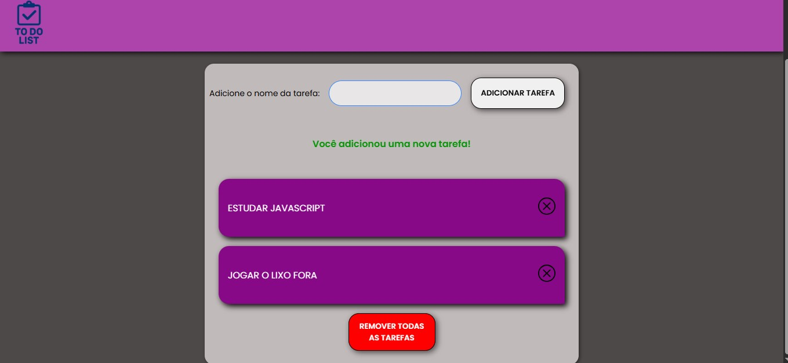

# 📝 To Do List

  
  
  
  

## 📌 Sobre o Projeto

Este é um projeto de **To Do List (Lista de Tarefas)** desenvolvido com o intuito de **praticar HTML, CSS e principalmente JavaScript**.  
O foco foi treinar manipulação de DOM, eventos e lógica de programação.

O design foi pensado em **Mobile First**, garantindo que a aplicação seja **totalmente responsiva** em diferentes dispositivos.

---

## 🚀 Funcionalidades

✅ Adicionar novas tarefas  
✅ Marcar tarefas como concluídas  
✅ Excluir tarefas individualmente  
✅ Botão para **remover todas as tarefas** de uma vez  
✅ Feedback visual e mensagens de aviso  
✅ Layout responsivo (Mobile First)

---

## 📱 Layout

🔹 Desenvolvido com **Mobile First**  
🔹 Responsivo para telas maiores (tablet e desktop)  
🔹 Interface simples, limpa e intuitiva

---

## 🛠️ Tecnologias Utilizadas

- **HTML5** → Estrutura do projeto
- **CSS3** → Estilização e responsividade
- **JavaScript (ES6+)** → Lógica principal e manipulação de DOM

---

## 🎯 Objetivos do Projeto

- Treinar lógica com JavaScript
- Praticar manipulação de DOM e eventos
- Criar um layout **responsivo e funcional**

---

## 📸 Demonstração

## Deploy 📎

